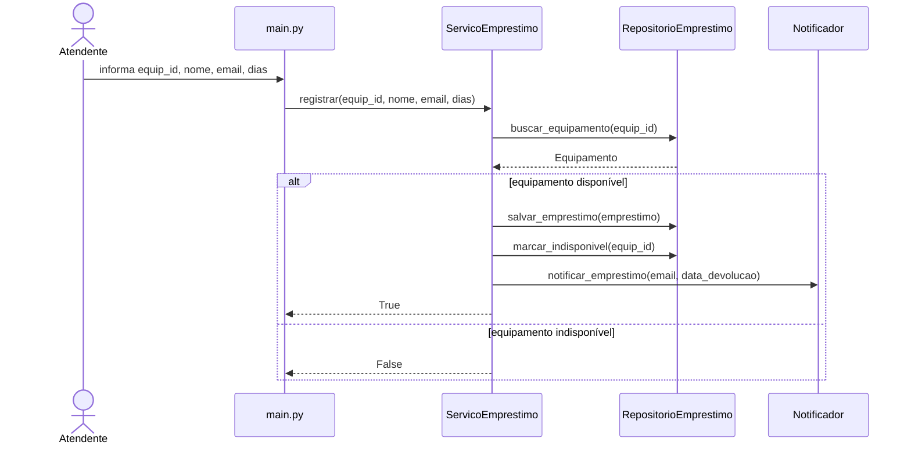
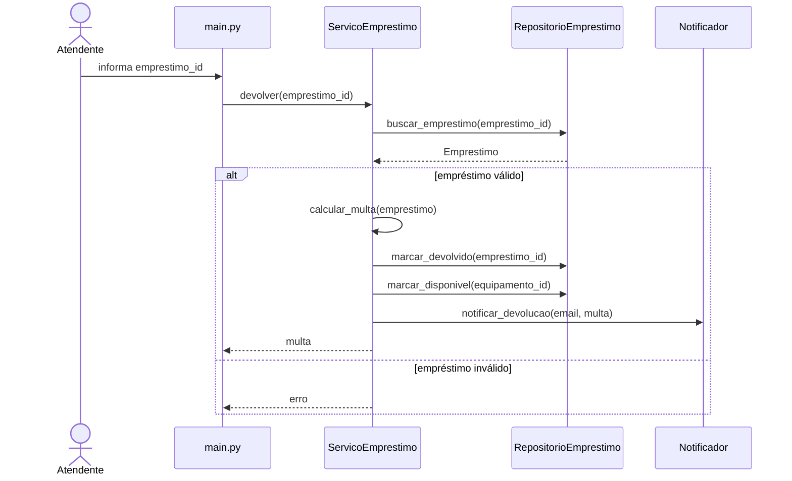
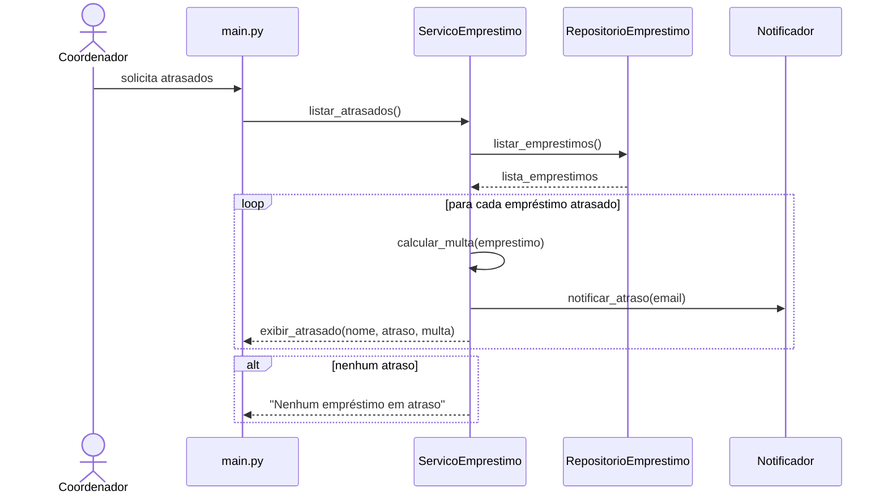

# Diagramas e Decomposição em Camadas

## Decomposição em camadas

- `models/Equipamento`
Representa a entidade de domínio equipamento. Possui apenas dados e alta coesão por entidade.

- `models/Emprestimo`
Representa a entidade de domínio empréstimo. Centraliza os dados relacionados ao empréstimo sem regras de interface.

- `services/ServicoEmprestimo`
Responsável pelas regras de negócio dos casos de uso UC01, UC02 e UC03. Possui alta coesão por concentrar apenas operações de empréstimo.

- `services/Notificador`
Responsável exclusivamente pelo envio de notificações. Separado para manter SRP e permitir mudança futura do canal de notificação.

- `repositories/RepositorioEmprestimo`
Responsável pelo acesso e persistência de dados. Oculta detalhes de armazenamento das demais camadas.

- `main.py`
Responsável apenas pela interface CLI e interação com o usuário. Não contém regras de negócio.

---

# Diagramas de sequência

## UC01 — Registrar Empréstimo

## UC02 — Registrar Devolução

## UC03 — Listar Empréstimos em Atraso

